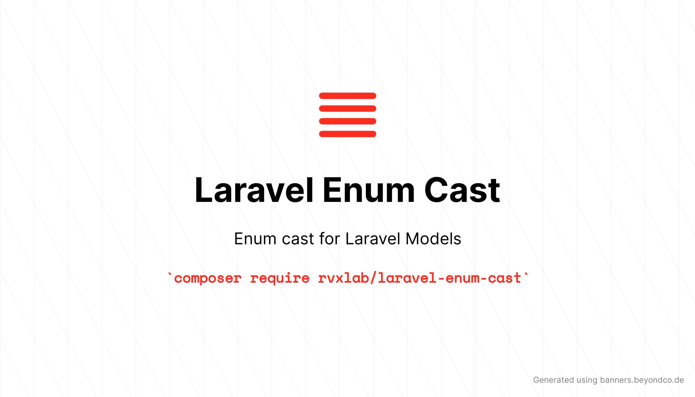

# Laravel Enum Cast

Enum cast for Laravel Models using [myclabs/php-enum](https://github.com/myclabs/php-enum).

## Installation

Install through composer

```shell
composer require rvxlab/laravel-enum-cast
```

## Usage

Add the `CastsEnums` trait to your model, add the `EnumCast` class to the `$casts` array and create an `$enums` array to tell which enum should be used.

```php
class CarMake extends \MyCLabs\Enum\Enum
{
    public const VOLKSWAGEN = 'volkswagen';
    public const BMW = 'bmw';
}

class Car extends \Illuminate\Database\Eloquent\Model
{
    use \RVxLab\LaravelEnumCast\CastsEnums;
    
    protected $casts = [
        'make' => \RVxLab\LaravelEnumCast\EnumCast::class,
    ];
    
    protected $enums = [
        'make' => CarMake::class,
    ];
}
```

That's it, you're all set!

## License

This project uses the MIT License
